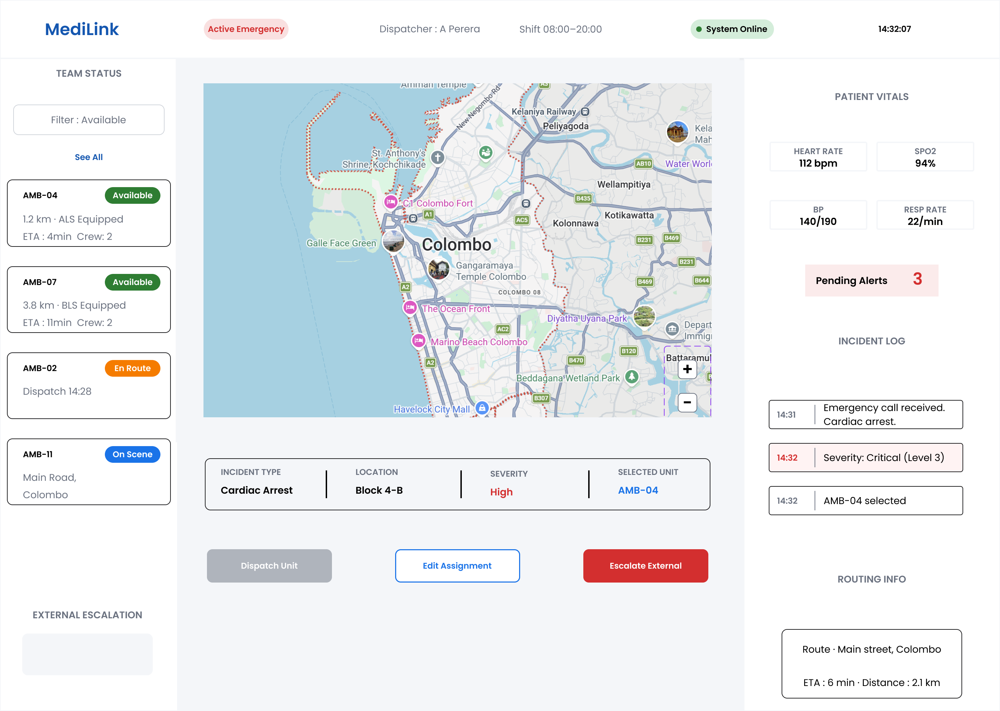
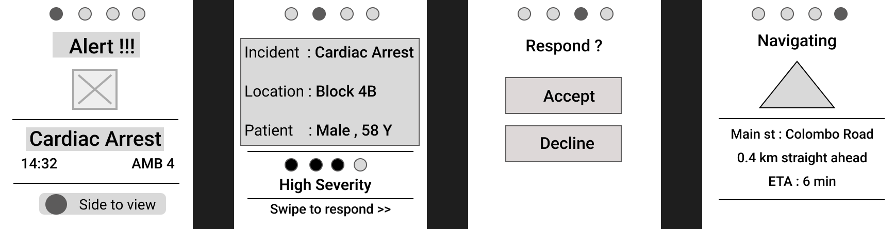
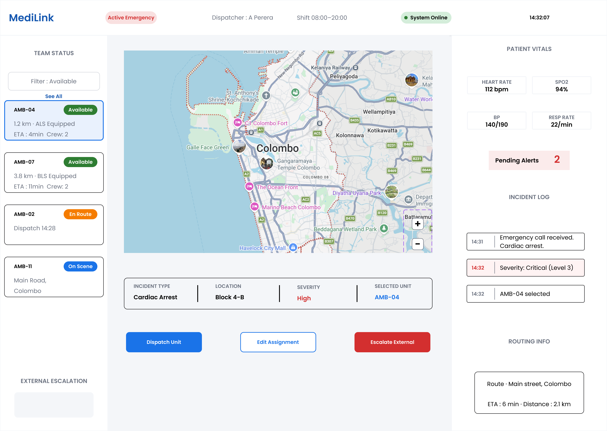
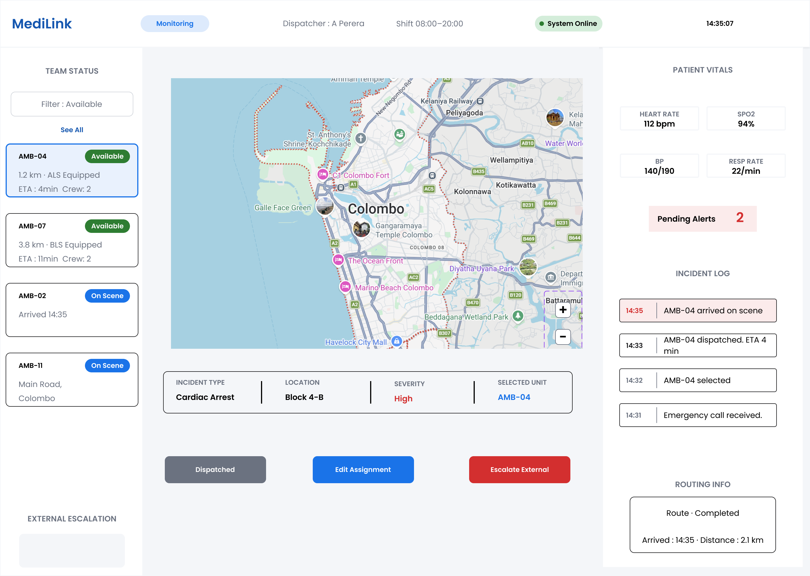
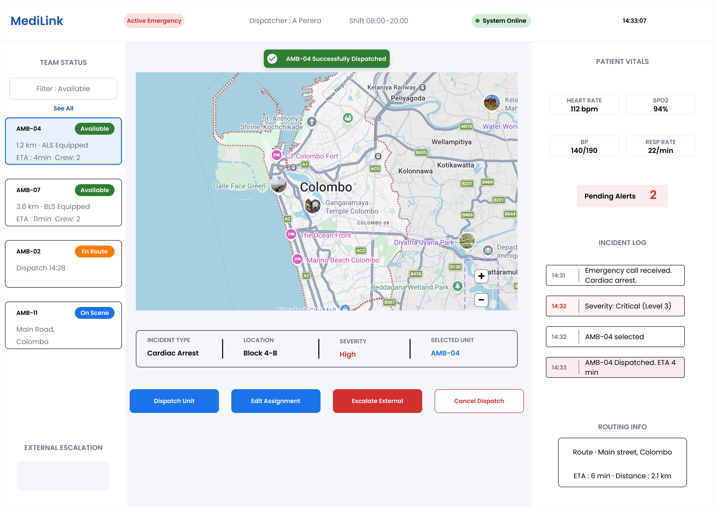
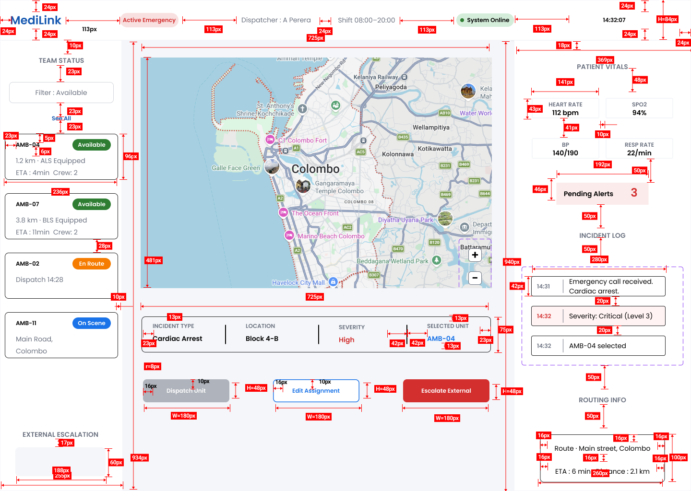

# MediLink — Emergency Dispatch Design System

A high-fidelity UX/UI case study for an emergency dispatch platform, covering a dispatcher desktop dashboard and a first-responder smartwatch interface. Built as part of a university Interface Design & UX module, this project takes a concept from low-fidelity wireframes through to a fully componentised, prototyped, and developer-ready design system in Figma.



---

## Project Overview

MediLink is a fictional emergency response system connecting a control-room dispatcher with paramedics in the field. The project explores how the same core task — getting help to a patient as fast as possible — needs two completely different interfaces depending on context: a calm, information-dense desktop environment for the dispatcher, and a fast, low-friction smartwatch interface for a responder under physical stress.

**Role:** Solo UX/UI Designer
**Tools:** Figma (Auto Layout, Variants, Variables, Prototyping), Nielsen Heuristic Evaluation
**Duration:** University module project, two assignments (Low-fi → High-fi)

---

## Design Process

### 1. Task Analysis
Before any screens were drawn, the core task was broken down using a **Hierarchical Task Analysis (HTA)**, mapping the full journey from "Receiving the Emergency Alert" through to "Confirmation and Navigation of the Responder." This informed the user flow for both the dispatcher and the responder paths.

### 2. Low-Fidelity Wireframes
Wireframes were built for both platforms to validate the structure before visual design:

| Desktop Dispatcher Dashboard | Smartwatch Responder Flow |
|---|---|
|  |  |

Additional desktop wireframe exploration:

.png)

### 3. Design System (Atomic Design)
Rather than designing screens in isolation, every interface element was built as a reusable component following atomic design principles — Atoms first, then Molecules, then full screens.

**Atoms** — buttons, inputs, badges, icons, and status indicators:

.png)

**Molecules** — alert cards, unit rows, incident bars, and log rows composed from those atoms:

.png)

**Design tokens** (colors, typography) were defined as Figma Local Styles and mirrored as Figma Variables, so the entire interface can be re-themed from a single source of truth.


### 4. High-Fidelity Prototype & Interaction Logic
The desktop dashboard was built as a clickable, stateful prototype using **Figma Variables** to simulate real software behaviour rather than a static slideshow:

- A `pendingAlerts` number variable drives the alert counter, which decrements when a dispatcher acknowledges an alert
- A `selectedUnit` variable highlights the active ambulance unit and enables the previously-disabled "Dispatch Unit" button — a real conditional logic state, not just a linked screen
- Screen transitions use Smart Animate to mimic native OS-level motion

| Main Dashboard (no unit selected) | Unit Selected |
|---|---|
|  |  |

| Monitoring State | Unit Dispatched |
|---|---|
|  |  |

### 5. Usability Testing
The prototype was evaluated against **Nielsen's 10 Usability Heuristics**. Issues identified through this audit (e.g. visibility of system status on unread alerts) directly informed design changes — such as adding unread-state indicators and acknowledgement color coding visible in the Alert Card component.

### 6. Developer Handoff
To bridge the gap between design and engineering, a manual redline specification was produced for the most complex screen — documenting exact padding, margins, typography (font, weight, size, line-height), and interaction behaviour (hover states, transitions), drawn by hand rather than relying on automated Dev Mode output.



---

## Key UX Principles Applied

This project's interface decisions are grounded in HCI theory rather than visual preference:

- **Fitts's Law** — Target size and distance directly inform component sizing. Desktop elements are mouse-optimised (e.g. 245×99px unit cards); smartwatch tap targets follow Apple's 44px minimum guidance for touch accuracy under physical stress.
- **Hick's Law** — Choice count is deliberately reduced as user stress increases. The calm dispatcher environment offers 3 action choices; the smartwatch's critical decision screen offers only 2 (Accept / Decline), minimizing response time when it matters most.
- **Nielsen's Heuristics** — Used as a structured audit framework to catch and fix usability issues prior to handoff.

---

## Figma Prototypes

- **Assignment 1 — Wireframes & UX Research:**
- **[Figma Link- Desktop]: https://www.figma.com/design/tSe5g9eHH9a9kln8wZntQJ/Wireframes?node-id=0-1
- **[Figma Link- SmartWatch]: https://www.figma.com/design/tSe5g9eHH9a9kln8wZntQJ/Wireframes?node-id=39-224
- **Assignment 2 — High-Fidelity Design System & Prototype:** [Figma Link]:https://www.figma.com/design/bqPWIha0Vlo9vnY0kRMtYw/Assignment-2?
node-id=2134-497&t=yndpcSzjlxderrip-1

---

## Repository Structure

```
medilink-ux-portfolio/
├── README.md
├── designs/
│   ├── wireframes/
│   │   ├── Desktop - 1.png
│   │   ├── Desktop - 2 (1).png
│   │   └── Wireframes-Smartwatch.png
│   └── high-fidelity/
│       ├── Local Styles page.png
│       ├── Component Library (Atoms).png
│       ├── Component Library (Molecules).png
│       ├── Dashboard-Main.png
│       ├── Dashboard-UnitSelected.png
│       ├── Dashboard-Monitoring.png
│       ├── Dashboard-Dispatched.png
│       └── DEV-HANDOFF-SPEC.png
└── Presentation/
    ├── Assignment01.pdf
    └── Assignment02.pdf
```

---

## About Me

Computing student with a focus on UX/UI design and front-end interfaces, building a portfolio of practical, research-backed design work ahead of internship applications.

**Contact:** 
 LinkedIn - 
linkedin.com/in/niduli-gokaralla

